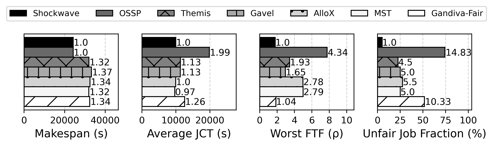

# NSDI 2023 Experiments

This document describes how to run the main experiments in the [NSDI '23](https://www.usenix.org/conference/nsdi23) paper [Fair and Efficient Cluster Scheduling for Dynamic Adaptation in Machine Learning](https://www.usenix.org/conference/nsdi23/presentation/zheng).

## Setup

### Software Dependencies

Shockwave/Gavel is implemented in Python. We have tested Shockwave/Gavel on Ubuntu 18.04 with Python 3.6.9.
Python can be installed using [Miniconda](https://docs.conda.io/en/latest/miniconda.html).

Required software dependencies can be installed using:

```bash
apt-get -y install cmake g++ gcc libnuma-dev make numactl zlib1g-dev
pip install -r scheduler/requirements.txt
cd scheduler; make
```

## Reproducing Experiments

Gavel's policies (including Shockwave) and scheduling mechanism can be evaluated either in simulation or on a physical cluster.

We mostly provide simulation result in this paper because they are more accessible and don't require hundreds of GPUs to run. Moreover, Shockwave/Gavel uses the same scheduling/resource allocation core for both physical and simulation, so we naturally have high fidelity. Note that we are using Intel Xeon Gold 6248 CPUs in our development environment, and having CPU contention or using crappy CPUs might yield worse performance. Also, Shockwave may need fine-tuning of `k` and `lambda` to achieve its maximal performance: please see the paper for a detailed evaluation.

We provide a JSON file with measured throughputs for the target workloads used in our experiments at `wisr_throughputs.json`. Experiments are run from the `scheduler/` sub-directory.

We also include instructions on how to deploy Shockwave/Gavel on a physical cluster.

| Section      | Figure reproduced |
| ------------ | ------------------ |
| Canonical result | N/A |
| Physical 32-GPU TACC | Fig. 7: [Physical] Evaluating Shockwave on a 32-GPU cluster |
| Physical 32-GPU TACC | Tab. 3: Shockwave simulator's fidelity |
| Scale analysis | Fig. 9: [Simulation] Evaluating Shockwave in differently-sized large clusters |
| Contention factor analysis | Fig. 16: [Physical] Evaluating Shockwave under different contention factors (CFs) in a 14-GPU cluster |

### Canonical result



Our canonical result is a simulation of all policies over a single 120-job trace on a 32-GPU cluster.

To reproduce, run [`scheduler/reproduce/tacc_32gpus.sh`](scheduler/reproduce/tacc_32gpus.sh). In our development environment, simulating Shockwave takes ~10 minutes to finish, while the other policies take less than a minute each. 

### Physical 32-GPU TACC

We provide the pickles of running the same trace in physical (32-GPU cluster on [TACC](https://www.tacc.utexas.edu/)) and simulation at [`scheduler/reproduce/pickles/tacc_32gpus`](scheduler/reproduce/pickles/tacc_32gpus). We also provide a script to analyze the simulation fidelity at [`scheduler/reproduce/analyze_fidelity.py`](scheduler/reproduce/analyze_fidelity.py).

For deploying Shockwave in a physical cluster, TODO: Add the scripts used to deploy shockwave physically, see section below

### Scale analysis

We use three differently-sized GPU clusters in this microbenchmark: 64 GPUs, 128 GPUs, and 256 GPUs.

The corresponding bash script for running the trace for {64,128,256} GPUs are `/shockwave/scheduler/reproduce/scale_{64,128,256}gpus.sh`. Each shell script runs the different policies we used in our evaluation over a single pre-defined, dynamic-arrival workload trace, generated using different seeds, arrival rates, duration distributions, scale factor distributions, and dynamic adaptation mode distributions.

### Contention factor analysis

We provide the pickles of running three different traces of varying contention factors in a 14-GPU cluster on [TACC](https://www.tacc.utexas.edu/) at [`scheduler/reproduce/pickles/tacc_14gpus`](scheduler/reproduce/pickles/tacc_14gpus).


### Physical Cluster

TODO: clean this up before our next release

In a physical cluster, Shockwave/Gavel is comprised of a centralized scheduler (deployed on a separate scheduling server) and workers (each worker has 1 or more GPUs). Jobs are submitted to the scheduler. The scheduler then computes a dynamic-adaptation-aware allocation for each active job using its policy framework. It then uses its round-based scheduling mechanism to determine how to grant resources to jobs.

We provide scripts to launch both the scheduler and workers. Make sure the software dependencies are installed on the scheduler and workers as described above. To launch the scheduler, use `scripts/drivers/run_scheduler.py` as follows (note that `expected_num_workers` indicates the expected number of GPUs, not the number of workers `TODO: double check this?!`):
```bash
python scripts/drivers/run_scheduler_with_trace.py \
  --trace traces/physical_cluster/artifact_evaluation.trace \
  --seed 0 \
  --solver ECOS \
  --throughputs_file physical_cluster_throughputs.json \
  --time_per_iteration 360 \
  --policy min_total_duration_perf \
  --expected_num_workers 6
```
Running this command will start the scheduler and log the IP address the server is running with. Using this IP address, we can launch a worker as follows:
```bash
python worker.py \
  -t v100 \
  -i [IP_ADDRESS] -s 50070 -w 50061 -g [NUM_GPUS_ON_WORKER] \
  --static_run_dir /path/to/vanilla/workloads/pytorch \
  --accordion_run_dir /path/to/accordion/workloads/pytorch \
  --gns_run_dir /path/to/gns/workloads/pytorch \
  --data_dir /path/to/datasets \
  --checkpoint_dir /path/to/checkpoints
```
This should be done for all workers in the cluster. Note that because our work does not take account of heterogeneity, only V100 GPU workers are supported (i.e., `v100` must be passed into the `-t` argument). However, Shockwave can be used as long as the cluster uses homogeneous hardware and a throughput file corresponding to the specific hardware is passed in.

Temporary storage:
```bash
python3 /home/ruipan/gavel/scheduler/scripts/drivers/run_scheduler_with_trace.py \
  --trace /home/ruipan/gavel/scheduler/traces/reproduce/120_0.2_5_100_40_25_0,0.5,0.5_0.6,0.3,0.09,0.01_multigpu_dynamic.trace \
  --seed 0 \
  --solver ECOS \
  --time_per_iteration 120 \
  --expected_num_workers 1 \
  --throughputs_file /home/ruipan/gavel/scheduler/wisr_throughputs.json \
  --policy min_total_duration > ./test_scheduler.txt 2>&1 &

python3 /home/ruipan/gavel/scheduler/worker.py   -t v100   -i 10.0.1.249 -s 50070 -w 50061 -g 3 \
  --static_run_dir /home/ruipan/gavel/workloads/pytorch \
  --accordion_run_dir /home/ruipan/gavel/accordion_workloads/pytorch \
  --gns_run_dir /home/ruipan/gavel/gns_workloads/pytorch \
  --data_dir /home/ruipan/data \
  --checkpoint_dir /mnt/nfs/temp > ./test_worker.txt 2>&1 &

TODO: add these to the physical scheduler driver:
--config ../configurations/tacc_32gpus.json \
--pickle_output_dir ../../reproduce/pickles \
```

<!-- TODO: include something like this in our next release -->

<!-- The included trace for artifact evaluation should complete in about 2 hours using a cluster size of 6 GPUs (2 V100s and 4 K80s), and is intended merely to show that the infrastructure required to deploy Gavel in a physical cluster is included; actually replicating the physical cluster experiments shown in the paper will require more resources for a much longer duration. -->
